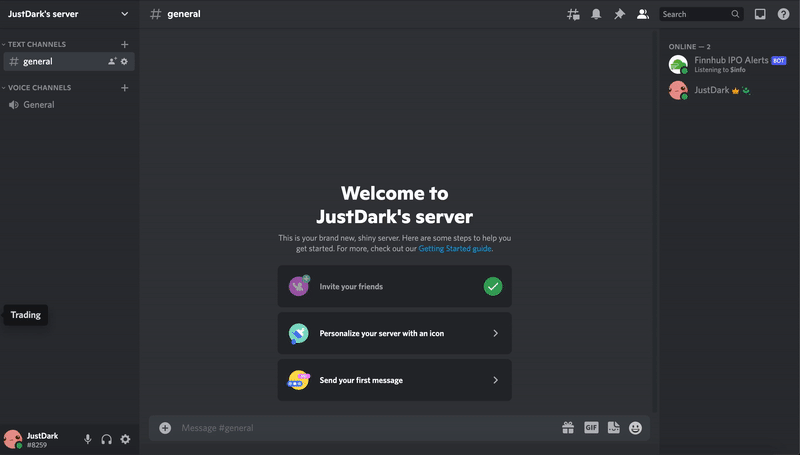

<div id="top"></div>

<!-- PROJECT LOGO -->
<div align="center">
  <a href ="https://discord.com/"></a>
  <a href="https://finnhub.io/"></a>
  <h3 align="center"><strong>Finnhub-IPO-Bot</strong></h3>
  <p align="center">
    The Discord bot that tracks U.S. stock IPO events using the Finnhub API.
    <br>
  </p>
  <p align="center">
    <strong>Features Include:</strong><br>
    Constant Scanning & Automatic IPO alerts<br>
    Check the IPO Calendar for all Valid Timeframes
  </p>
</div>

___

<!-- TABLE OF CONTENTS -->
### Table of Contents
<details>
  <ol>
    <li><a href="#getting-started">Getting Started</a></li>
    <li><a href="#usage">Usage</a></li>
    <li><a href="#demo">Demo</a></li>
  </ol>
</details>
<br>


<!-- GETTING STARTED -->
<div id="getting-started"></div>

## Getting Started

1. Clone the repo
   ```sh
   git clone https://github.com/hschickdevs/Finnhub-IPO-Bot.git
   ```
2. Install latest version (*<-important*) of pip packages
   ```sh
   pip install --upgrade -r requirements.txt
   ```
3. Create a Discord bot if you haven't already, and invite the bot into your Discord server 
[(Setup Tutorial Here)](https://discordpy.readthedocs.io/en/stable/discord.html) [(How to Get Channel ID)](https://turbofuture.com/internet/Discord-Channel-ID)

4. Get a free API key from [Finnhub.io](https://finnhub.io/register)

5. Set the required [config](https://github.com/hschickdevs/Finnhub-IPO-Bot/blob/main/src/_config.py) values:
    - Option 1: Create a .env file in the root directory
    - Option 2: Set environment variables in your local shell
    - Option 3: Hard code them into the src/config.py file

<p align="right">(<a href="#top">back to top</a>)</p>


<!-- USAGE EXAMPLES -->
<div id="usage"></div>

## Usage

To get started, navigate to the repository's root directory and run the main.py script:
```sh
python main.py
```

### Bot Commands

- The command prefix by default is "$":
  - `$info`: Returns the available commands and their syntax
  - `$quote SYMBOL`: Returns market quote for the specified symbol
  - `$sentiment SYMBOL`: Returns the news sentiment for the specified symbol (Requires Finnhub premium API key)
  - `$ipocal YYYY-MM-DD (<- from) YYYY-MM-DD (<- to)`: Returns stocks registered for IPO between the specified dates
  

### IPO Event Alerts

- The IPO alerts are automated, and poll the Finnhub API every 30 seconds by default for new IPOs.
- You can check the current IPOs being polled by using the following command:
    ```sh
    $ipocal today tomorrow
    ```

<p align="right">(<a href="#top">back to top</a>)</p>


<!-- DEMO -->
<div id="demo"></div>

## Demo



<p align="right">(<a href="#top">back to top</a>)</p>